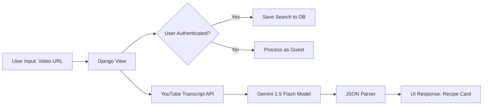

# Reel To Meal: AI-Powered Recipe Extraction System

**Live Deployment:** [https://reeltomeel.pythonanywhere.com/](https://reeltomeel.pythonanywhere.com/)

## 📌 Project Overview
**Reel To Meal** is a full-stack web application designed to bridge the gap between multimedia cooking content and actionable culinary data. The system utilizes the **Gemini 2.5 Flash** multimodal LLM to parse video URLs (specifically where login not required) and extract structured recipes, including ingredient quantities converted to SI units, required kitchen instrumentation, and step-by-step instructions.

## 👥 Contributors (Group [Number/ID])
*   **Shubham Mandal [2351129]** 
*   **Shreya Yadav [2351162]** 
*   **Lalit Snadhu [2351192]** 
*   **Marbi Bala [2351193]** 

## 🛠 Technical Stack
*   **Backend:** Django 5.x (Python)
*   **AI Model:** Google Gemini 2.5 Flash (Generative AI)
*   **Database:** SQLite (Development) / PostgreSQL (Production ready)
*   **Frontend:** HTML5, Tailwind CSS, Animate.css
*   **APIs & Libraries:** 
    *   `google-generativeai` (SDK for Gemini)
    *   `youtube-transcript-api` (Data extraction)
    *   `python-dotenv` (Environment variable management)

## ⚙️ Key Technical Features
1.  **Multimodal Data Extraction:** The system attempts to fetch video transcripts via the YouTube Transcript API to provide context to the LLM. If unavailable, it utilizes the model's knowledge of the URL metadata.
2.  **SI Unit Normalization:** A custom prompt engineering layer forces the AI to convert Imperial units (lbs, oz, cups, °F) into International System of Units (g, kg, ml, °C).
3.  **State Management:** 
    *   **Guest Mode:** Session-less processing for immediate usage.
    *   **Persistent History:** Logged-in users utilize a relational database model to store and retrieve past recipe searches.
4.  **Security:** Implements environment variable masking for API keys and Django secret keys using `.env` files.
5.  **Responsive UI:** A minimalist "Glassmorphism" interface built with Tailwind CSS, featuring CSS-based animations for asynchronous data loading states.

## 🏗 System Architecture


## 🚀 Installation & Local Setup

1.  **Clone the Repository:**
    ```bash
    git clone https://github.com/[your-username]/reel-to-meal.git
    cd reel-to-meal
    ```

2.  **Initialize Virtual Environment:**
    ```bash
    python -m venv venv
    source venv/bin/activate  # Windows: venv\Scripts\activate
    ```

3.  **Install Dependencies:**
    ```bash
    pip install -r requirements.txt
    ```

4.  **Environment Variables:**
    Create a `.env` file in the root directory:
    ```env
    GEMINI_API_KEY=your_api_key_here
    DJANGO_SECRET_KEY=your_secret_key_here
    DEBUG=True
    ```

5.  **Database Migration:**
    ```bash
    python manage.py makemigrations
    python manage.py migrate
    ```

6.  **Run Development Server:**
    ```bash
    python manage.py runserver
    ```

## 📊 Database Schema
| Field | Type | Description |
| :--- | :--- | :--- |
| `user` | ForeignKey | Relation to Django User model (nullable) |
| `video_url` | URLField | Original source link |
| `title` | CharField | Extracted recipe name |
| `ingredients` | TextField | JSON-formatted list of ingredients in SI units |
| `instructions` | TextField | Step-by-step cooking guide |
| `instruments` | TextField | List of kitchen tools required |
| `serving_size` | CharField | Extracted serving quantity |
| `created_at` | DateTime | Timestamp of search |

## 📝 License
This project was developed for academic purposes at Heritage Institute of Technology as part of the Project - I [CSE3295] curriculum.

---
